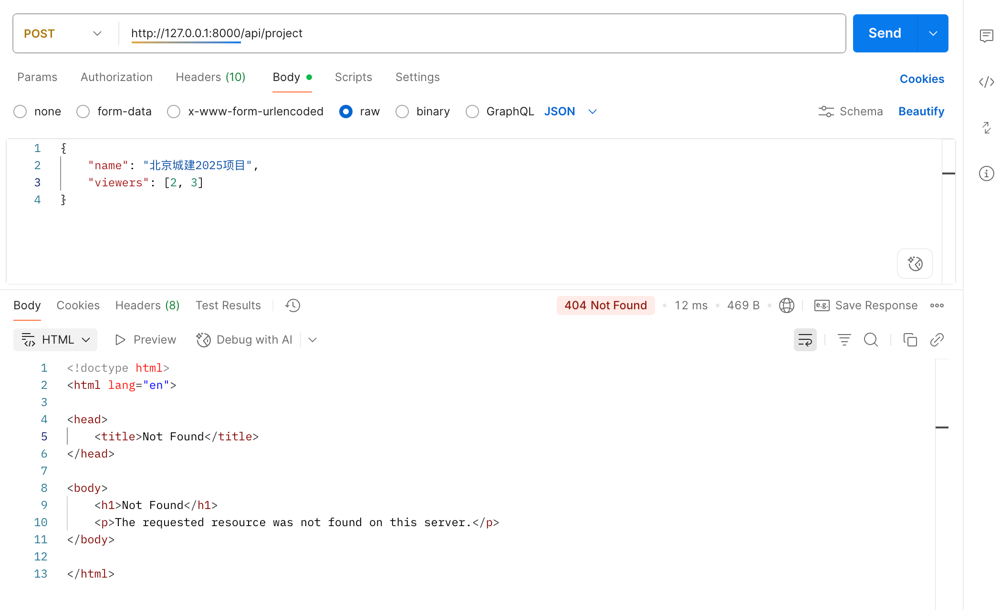

## 1. Q&A

### 1. How to manage environment variables uniformly?

Environment variables distributed in various files can easily bring difficulties to project maintenance. Therefore, it is stipulated that except for **env.py**, environment variables should not be defined anywhere else.

### 2. How to define base_model?

Define the base model in the `base` app, and other places can inherit the base model from this. In addition, the base app also defines a base response. If it is a post request, a unified set of returns is used, and there is no need to define returns in each one.

### 3. How to grasp the boundaries of database design?

- Project table, do you need to store the total number of files? No, adding it would be redundant design.

### 4. How to use foreign keys?

- Many-to-One: A project can only be created by one user, and one user can create multiple projects. The relationship between projects and users is a Many-to-One relationship. You can directly use `ForeignKey` in the project. If the user is deleted, the projects they created are allowed to continue to exist, so use `on_delete=models.SET_NULL`
- Many-to-Many: A project can be viewed by multiple users, and one user can view multiple projects. The relationship between projects and users is a Many-to-Many relationship.

### 5. How to do exception handling?

Define a `BaseAPIView`, and other views inherit this

```python
from rest_framework.views import APIView
from api.app.base.http.response import BaseResponse


class BaseAPIView(APIView):
    """Custom base APIView, providing exception handling"""

    def handle_exception(self, exc):
        """Override exception handling method"""
        # Record exception log
        # logger.error(f"API exception: {str(exc)}", exc_info=True)

        # Return unified error response
        return BaseResponse.error(
            message="System exception, please try again later",
            status_code=500
        )

    def dispatch(self, request, *args, **kwargs):
        """Override dispatch method to capture all exceptions"""
        try:
            return super().dispatch(request, *args, **kwargs)
        except Exception as exc:
            return self.handle_exception(exc)
```

Inherit BaseAPIView

```python
class RegisterView(BaseAPIView):
    permission_classes = [AllowAny]

    def post(self, request):
        serializer = RegisterInputSerializer(data=request.data)
        # is_valid: Validate if parameters are legal, first validate fields, then validate [field_name_validator], and finally validate the validate method
        if serializer.is_valid():
            serializer.save()
            return BaseResponse.created(message="Registration successful")
        return BaseResponse.error()
```

### 6. How to use status codes reasonably?

- 200: Request successful, and data is returned, for example, the user login interface, we will return token data
- 201: Resource creation successful, no data returned, for example, user registration, we don't need to return data
- 400: Invalid request (parameter error, format error)
- 401: Unauthenticated, missing or invalid identity credentials

- 404: Interface does not exist
- 500: Server error

### 7. How to convert status codes?

It can be temporarily omitted as it increases complexity

### 8. How to prompt when not logged in?

You can use `AuthenticationFailed` to catch exceptions

```python
from rest_framework.exceptions import AuthenticationFailed
def post(self, request, *args, **kwargs):
        try:
            response = super().post(request, *args, **kwargs)
            return BaseResponse.success(data=response.data, message="Login successful")
        except AuthenticationFailed as e:
            logger.exception(e)
            # Username or password error
            return BaseResponse.error(
                message="Account or password error",
                status_code=401
            )
```

### 9. How to prompt for token exceptions?

Exceptions can be handled in BaseView

```python
from rest_framework.exceptions import NotAuthenticated  
def handle_exception(self, exc):
      """Override exception handling method"""
      # Record exception log
      logger.exception(f"API exception: {str(exc)}", exc_info=True)

      if isinstance(exc, NotAuthenticated):
          # Authentication credentials not provided or invalid
          return BaseResponse.error(
              message="Authentication failed, please check if the Token is correct",
              status_code=401
          )
```


### 10. Can administrators see all projects?

Whether to do it through logic or through database management, add administrators to the visible users of each project

It's better to do it through logic. If new administrators join later, ensure they can also see all projects

### 11. How to convert Django-defined models to DDL statement comments

Just add the db_comment field

### 12. How to customize 404 error reporting?

The Django framework very friendly provides a configuration `handler404`, you just need to define an exception handler in `urls.py`

```python
handler404 = "api.app.base.exceptions.django_404_handler"
handler500 = "api.app.base.exceptions.django_500_handler"
```

This is the corresponding exception handler

```python
from django.http import JsonResponse
from api.utils.logger import logger


# Add Django's 404 handler
def django_404_handler(request, exception=None):
    """
    Handle Django-level 404 errors (URL route mismatch)
    """
    logger.info(f"Django 404 Handler: {request.method} {request.path}")
    response_data = {
        'success': False,
        'message': "The requested interface does not exist",
        'data': None,
        'code': 404
    }

    return JsonResponse(response_data, status=404)


def django_500_handler(request):
    """
    Handle Django-level 500 errors
    """
    logger.info(f"Django 500 Handler: {request.method} {request.path}")
    response_data = {
        'success': False,
        'message': "Internal server error",
        'data': None,
        'code': 404
    }
    return JsonResponse(response_data, status=500)
```

### 13. How to solve missing field errors?

You can define a global BaseSerializer to handle some field issues

```python
from rest_framework import serializers


class BaseSerializer(serializers.Serializer):
    """Base serializer, automatically add Chinese error messages"""

    # Unified Chinese error message configuration
    default_error_messages = {
        'required': '{field_name} field is required',
        'null': '{field_name} field cannot be null',
        'blank': '{field_name} field cannot be blank',
        'invalid': '{field_name} field format is incorrect',
        'max_length': '{field_name} field length cannot exceed {max_length} characters',
        'min_length': '{field_name} field length cannot be less than {min_length} characters',
        'max_value': '{field_name} field value cannot be greater than {max_value}',
        'min_value': '{field_name} field value cannot be less than {min_value}',
    }

    def __init__(self, *args, **kwargs):
        super().__init__(*args, **kwargs)
        self._apply_default_error_messages()

    def _apply_default_error_messages(self):
        """Apply default error messages to all fields"""
        for field_name, field in self.fields.items():
            # Set error messages for fields
            custom_messages = {}
            for error_key, error_template in self.default_error_messages.items():
                # Format error message, replace placeholders
                formatted_message = error_template.format(
                    field_name=field_name,
                    max_length=getattr(field, 'max_length', ''),
                    min_length=getattr(field, 'min_length', ''),
                    max_value=getattr(field, 'max_value', ''),
                    min_value=getattr(field, 'min_value', ''),
                )
                custom_messages[error_key] = formatted_message

            # Update field error messages, but don't overwrite existing custom messages
            field.error_messages.update(custom_messages)
```


### 14. How to count the total number of files in the project list?

Define foreign key association relationship in the Doc model

```python
class Doc(BaseModel):
    CHOICES = (
        (0, "Queuing"),
        (1, "Reviewing"),
        (2, "Review successful"),
        (3, "Review failed"),
    )

    project_id = models.ForeignKey(
        Project,
        on_delete=models.CASCADE,
        verbose_name='Project id',
        related_name='doc'
    )
```

Then in the `Project` model, you can directly use `obj.doc.count()` to get the total number

```python
    def get_document_count(self, obj):
        # Note: The reason why we can get the doc object here is because related_name is defined in the Doc model
        return obj.doc.count()
```

### 15. Can CRUD be put into one CBV?

The question here is, maybe add and delete can be put into one CBV, but modify and delete both need specific ids, can they be put together?

Yes, URL:

```python
from django.urls import path
from api.app.project.views import ProjectView
urlpatterns = [
    path('<int:pk>', ProjectView.as_view(), name='project'),
]
```

View function

```python
def delete(self, request, *args, **kwargs):
    logger.info(f"username:{request.user.username}")
    Project.objects.filter(id=kwargs['pk']).delete()
    return BaseResponse.success(message="Deletion successful")
```

### 16. Use real deletion or soft deletion?

Soft deletion is better, at least the data is still there

### 17. URL with trailing slash handling



You can define `APPEND_SLASH = False` in `settings.py`  

### 18. Do file upload interfaces need to be split?

It needs to be split. Create one interface for file upload, dedicated to uploading files; create one interface for upload tasks, dedicated to doing upload tasks.

### 19. How to do pagination?

You can define a pagination tool

```python
# utils/pagination.py
from django.core.paginator import Paginator
from api.app.base.http.response import BaseResponse


class PaginationHelper:
    @staticmethod
    def paginate_queryset(queryset, request, serializer_class):
        """
        Pagination tool method

        Args:
            queryset: Query set
            request: Request object
            serializer_class: Serializer class
        """
        # Get pagination parameters
        page_num = int(request.GET.get('page_num', 1))
        page_size = int(request.GET.get('page_size', 10))

        # Create paginator
        paginator = Paginator(queryset, page_size)
        page_obj = paginator.page(page_num)
        data = serializer_class(page_obj.object_list, many=True).data

        return BaseResponse.success(data)
```

### 20. How to do health check?


### 21. Django static files

#### (1) Do pure backends need static files?

Even if you only do backend development, the following Django components still need static files:

```python
INSTALLED_APPS = [
    'django.contrib.admin',        # Needs static files (CSS, JS, images)
    'django.contrib.auth',         # Needs static files  
    'rest_framework',              # DRF's browse API needs static files
    'drf_yasg',                    # Swagger UI needs a lot of static files
    # ...
]
```

#### (2) Specific configuration

| Configuration item     | Function                                                     | Common setting location |
| ---------------------- | ------------------------------------------------------------ | ----------------------- |
| **`STATIC_URL`**       | URL prefix when accessing static files (for browsers)        | Required                |
| **`STATICFILES_DIRS`** | The folder where you manually put static files during development. If we don't write frontend, we don't need this configuration | Development phase       |
| **`STATIC_ROOT`**      | The folder where all static files are uniformly stored after `collectstatic` collection | Deployment phase        |

**Note: In the development phase, we don't need and shouldn't run `collectstatic`**, it can be found automatically. For example

```python
python manage.py findstatic drf-yasg/style.css
Found 'drf-yasg/style.css' here:
  /Users/luoan/Documents/personal/项目代码/review_api/venv/lib/python3.10/site-packages/drf_yasg/static/drf-yasg/style.css
```

### 22. How to extend fields for Django's User table?

```python
# accounts/models.py
from django.contrib.auth.models import AbstractUser
from django.db import models

class User(AbstractUser):
    # Custom fields
    nickname = models.CharField(max_length=50, blank=True, null=True)
    avatar = models.ImageField(upload_to='avatar/', null=True, blank=True)
    # You can add other fields
```

Then declare it in `settings.py`

```python
AUTH_USER_MODEL = 'accounts.User'
```

